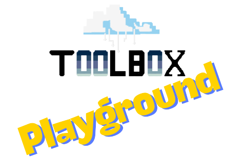

# Hello World NodeJs


## Uso local
Para usar o projeto Hello World Node.js, siga estas etapas:

1. Certifique-se de ter a versão atual do Node.js (v20.12.2) e do npm (v10.6.0) instaladas em sua máquina. Você pode baixar e instalar o Node.js e npm a partir do site oficial: [https://nodejs.org](https://nodejs.org). 

2. Abra o terminal ou prompt de comando e navegue até o diretório raiz do projeto.

3. Instale as depedências:
    ```bash
    npm install
    ```

4. Rode o projeto:
    ```bash
    npm start
    ```

5. Abra seu navegador e visite `http://localhost:8080` para ver a mensagem "Bem-Vindo ao Hello World da ToolBox DevOps".

## Uso Docker

Para executar o projeto Hello World Node.js em um contêiner Docker, siga estas etapas:

1. Certifique-se de ter o Docker instalado em sua máquina. Você pode baixar e instalar o Docker a partir do site oficial: [https://www.docker.com/get-started](https://www.docker.com/get-started).

2. Abra o terminal ou prompt de comando e navegue até o diretório raiz do projeto.

3. Execute o seguinte comando para construir a imagem Docker:

    ```bash
    docker build -t hello-world-nodejs .
    ```

    Isso criará uma imagem Docker com o nome `hello-world-nodejs`.

5. Após a conclusão da construção da imagem, execute o seguinte comando para iniciar um contêiner Docker:

    ```bash
    docker run -p 8080:8080 hello-world-nodejs
    ```

    Isso iniciará um contêiner Docker com base na imagem `hello-world-nodejs` e mapeará a porta 8080 do contêiner para a porta 8080 do host.

6. Abra seu navegador e visite `http://localhost:8080` para ver a mensagem "Bem-Vindo ao Hello World da ToolBox DevOps" sendo exibida.

Agora você está executando o projeto Hello World Node.js dentro de um contêiner Docker.