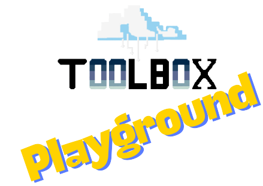

# Hello World Python com Docker


## Uso Local

Para usar o projeto Hello World Python com Docker, siga estes passos:

1. Certifique-se de ter o Docker instalado em sua máquina. Você pode baixar e instalar o Docker a partir do site oficial: [https://docs.docker.com/get-docker/](https://docs.docker.com/get-docker/).

2. Certifique-se que você está dentro do diretório `hello-world-com-docker-languages/python`.

3. Construa a imagem Docker:
    ```bash
    docker build -t hello-world-python .
    ```
    Obs.: Certifique-se que seu Docker está rodando.

4. Execute o contêiner Docker:
    ```bash
    docker run -p 5001:5000 hello-world-python
    ```

5. Abra seu navegador e visite `http://localhost:5001` para ver a mensagem "Bem-Vindo ao Hello World Flask Python". Evite usar a porta 5000 no seu host ou computador pois outras aplicações podem estar rodando em paralelo utilizando a mesma porta.

---

## 🎮 Lab Extra: Executar jogo Super Mario localmente com Docker

> **KAN-6** — Reforçar o conceito de que qualquer aplicação pode ser empacotada e executada via Docker, independente da linguagem ou stack.

### Objetivo

Baixar e executar o container do Super Mario localmente usando Docker, demonstrando na prática que o mesmo fluxo (`docker pull` → `docker run`) funciona para qualquer imagem — seja uma app Python/Flask, seja um jogo Java/Tomcat.

### Pré-requisitos

- Docker instalado e em execução
- Porta `8080` disponível no host

### Passos

1. Baixe a imagem do Super Mario:
    ```bash
    docker pull pengbai/docker-supermario
    ```

2. Execute o container em background:
    ```bash
    docker run -d --name supermario-game -p 8080:8080 pengbai/docker-supermario
    ```

3. Acesse o jogo no navegador:
    ```
    http://localhost:8080
    ```

4. Quando terminar, pare o container:
    ```bash
    docker stop supermario-game
    ```

### Executando tudo junto com Docker Compose

Para subir tanto o Hello World Python quanto o Super Mario de uma só vez, utilize o `docker-compose.yml` incluído neste diretório:

```bash
# Dentro de hello-world-com-docker-languages/python/
docker compose up -d
```

Serviços disponíveis:

| Serviço             | URL                         | Stack         |
|---------------------|-----------------------------|---------------|
| Hello World Python  | http://localhost:5001       | Python/Flask  |
| Super Mario         | http://localhost:8080       | Java/Tomcat   |

Para encerrar ambos os serviços:

```bash
docker compose down
```

### Conceito DevOps

Ambas as aplicações seguem o mesmo ciclo de vida Docker:

```
docker pull / docker build → docker run → docker stop
```

A diferença está apenas na stack interna da imagem — o Docker abstrai tudo isso para o usuário final.
